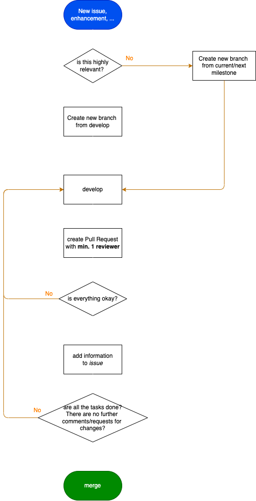

    

# [Slynite.com](https://slynite.com)
In this repository is the source code of the Slynite website. This project is build with [Next.js](https://nextjs.org/).

## Developer Envioment
Run in terminal `git clone https://github.com/Slynite/website/`

### Local
Run in terminal

### Using Docker
[Install Docker]() on your machine.
Build your container: `docker build -t slynite-web .`.

Run your container: `docker run -p 3000:3000 slynite-web`.

## Understand Versions
You would wonder how a version is construct for this project, but actually it is very easy and simple to understand.

For example the version 2022.04.1 has three parts.
- 2022: Year when the version was released.
- 04: Month when the version was released (in this example: April)
- 1: The number of release in this month and year.

## Development diagramm

Click to reveal diagramm

  

## Contributer

## License
This project is licensed under [MIT](./LICENSE) and proudly created by the [Slynite Team](https://slynite.com/team).

The Open soure Licenses we use can be found [here](https://slynite.com/legal/licenses).
